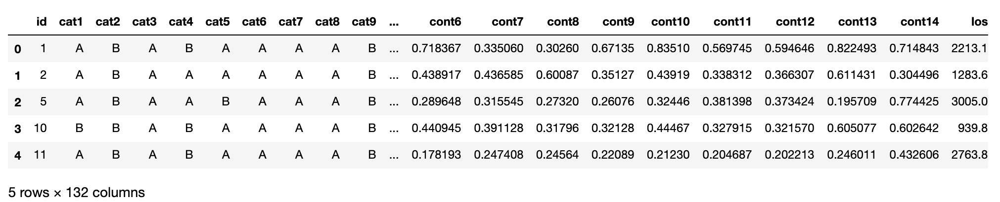
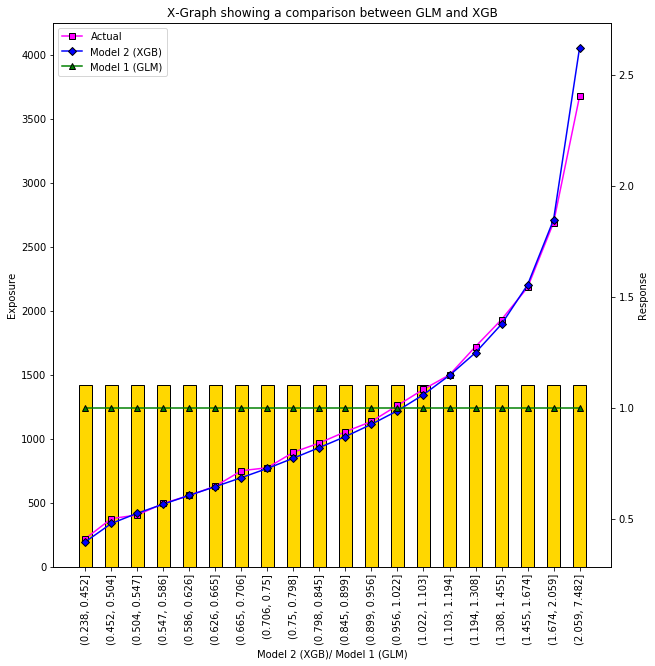
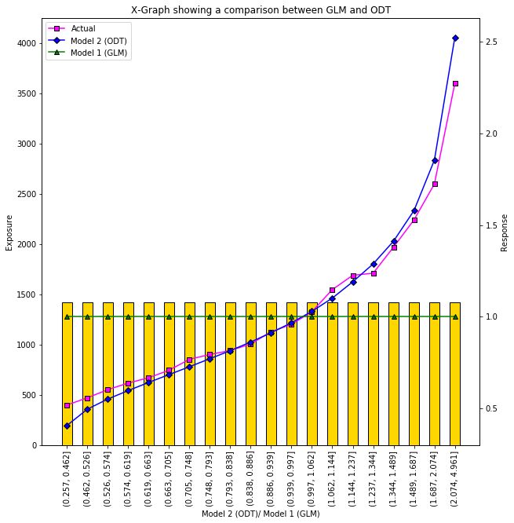
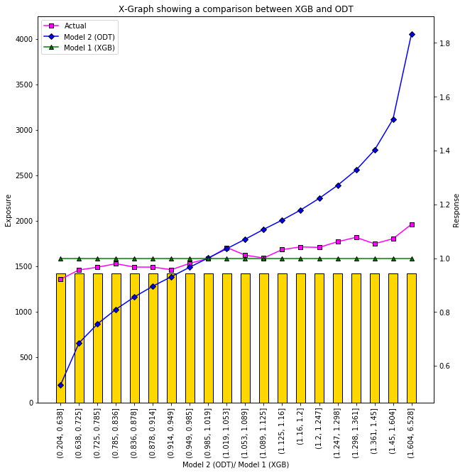
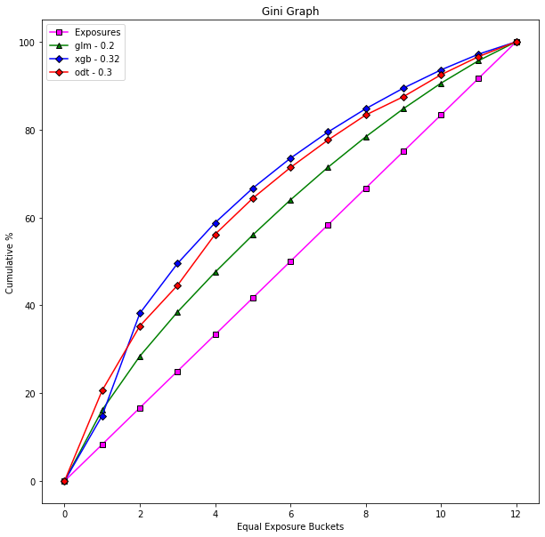

## Objective

To investigate the performance of GLM, Optimal Decision Trees and XGBoost algorithms on the Allstate Claims Severity Kaggle challenge (https://www.kaggle.com/c/allstate-claims-severity/overview).

## Contents

This repository contains:

- *data* - datasets for the analysis
- *evaluation* - summary statistics
- *glm* - code to build model
- *img* - images
- *notebooks* - workings for learning and development
- *optimal_decision_trees* - code to build model
- *outputs* - results
- *xgb* - code to build model

## Data

Each row in this dataset represents an insurance claim. Variables prefaced with 'cat' are categorical, while those prefaced with 'cont' are continuous. The objective is to predict the value for the 'loss' column.  

*train.csv* and *test.csv* datasets are provided for the challenge which contain 188318 and 125546 rows respectively.  

In order to develop the models, the *train.csv* dataset has been further partitioned into *modelling.csv* and *holdout.csv* samples where *modelling.csv* contains 160001 rows and *holdout.csv* contains 28317 rows.

An example of the dataset:

## Feature Engineering

Since the objective of this task is to assess the model performance, basic feature engineering methods were employed. In more detail:

- For all models, the response variable was subject to a log transformation and outlier capping. For categorical features with many levels, frequency binning was applied.
- For GLM and ODT models, categorical features were encoded as categoric, however, for the XGBoost model, the features were one-hot encoded.

## Method

Build three models:

- *GLM* - automated build fitting factors using forward selection.
- *XGBoost* - automated model build using XGBoost algorithm with Bayesian Hyper-optimisation.
- *ODT* - tuned as per interpretable.ai user guide with search range from max_depth 1 to 9.

## Results

#### Mean Absolute Error:
For reference, the winning kaggle competition (stacked NN and XGB model) has has a MAE of 1109.71.

- GLM mae result:  1605.18 (2dp)
- GLM kaggle mae result: 1604.37 (2dp)
- ODT mae result:  1298.60 (2dp)
- ODT kaggle mae result: 1291.27 (2dp)
- XGB mae result:  1191.18 (2dp)
- XGB kaggle mae result: 1189.11 (2dp)

#### X-graphs:

#### Gini:

## Future Developments

Developments to improve study:

- additional feature engineering
- modularise code and add orchestration file
- alter ODT code such that it is written in Julia in order to allow for multi-threading
- build XGBoost model on AWS GPU machine

## Author
Ben Turner with a special thanks to interpretable.ai for allowing me to trial their interpretableai package for personal use.
Q4 2020